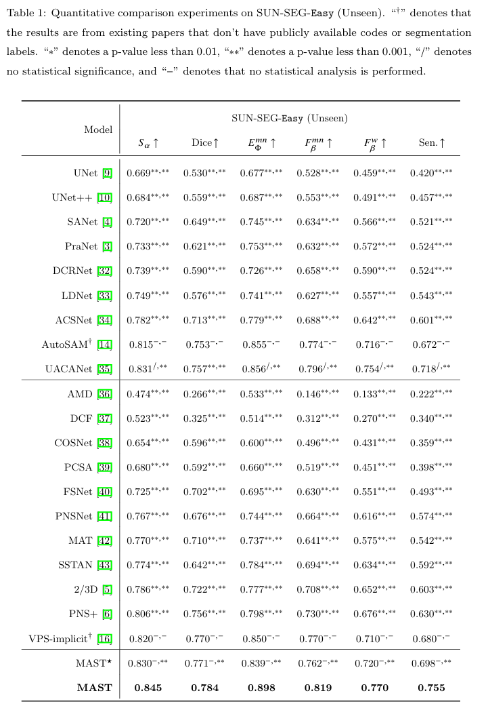
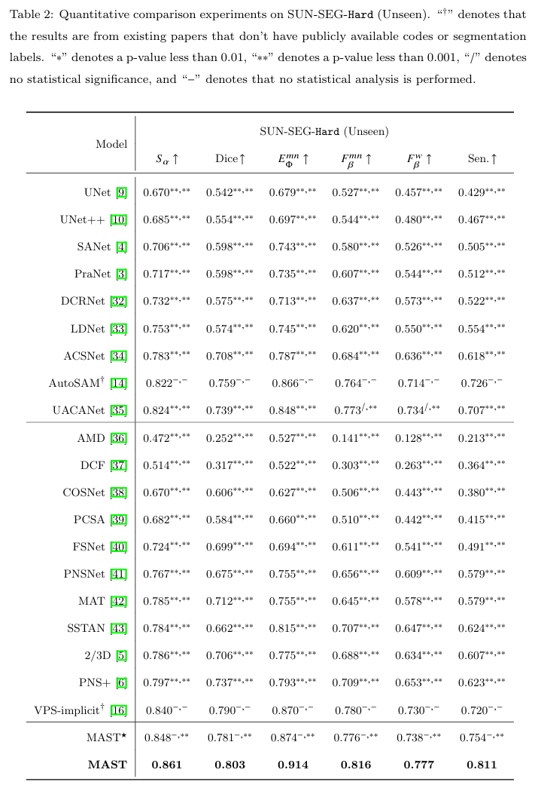

# MAST

This is the code of "**MAST: Video Polyp Segmentation with a Mixture-Attention Siamese Transformer**".

## Weights and Prediction

You can find the weights and predictions of our model in [Google Drive](https://drive.google.com/drive/folders/101fumxq6i72edyUBCFBqnpGvj739TUDg?usp=sharing).

If you want to test, please make a directory "weight" and put the weights in it. Then run MyTesting.py.

## Evaluation

You can find the weights and predictions of our model in [Google Drive](https://drive.google.com/drive/folders/101fumxq6i72edyUBCFBqnpGvj739TUDg?usp=sharing).

